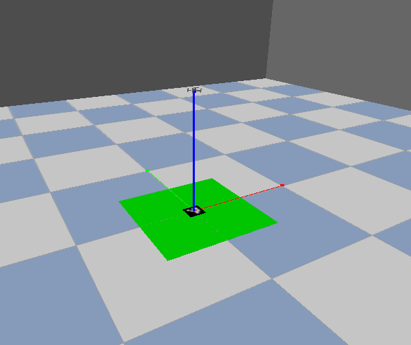
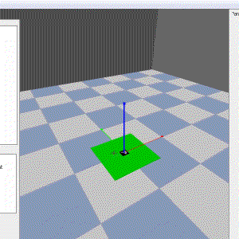
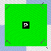
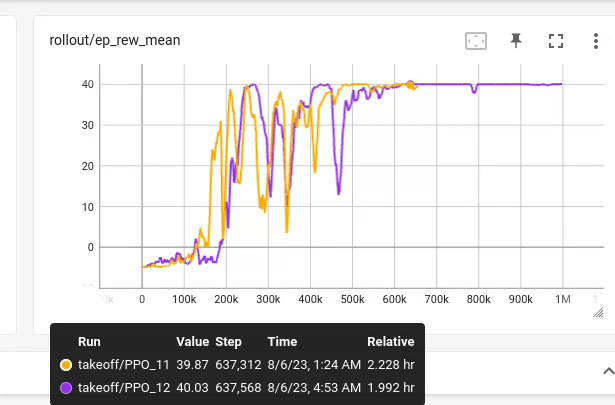
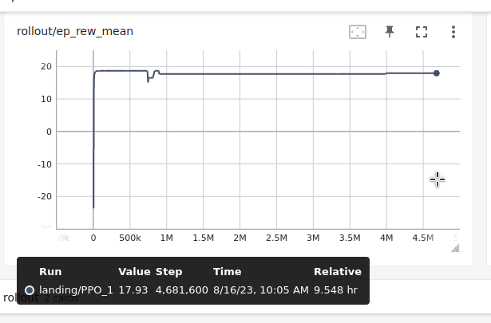
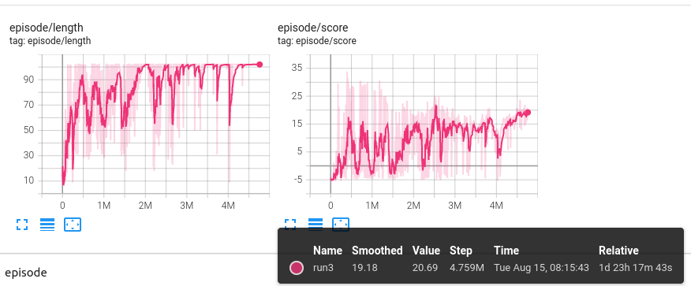

# Drone Training Repository

Welcome to the Drone Training Repository, where you can learn and experiment with different approaches to drone training in our specially designed aviary.

## Initial Setup

Before we dive into the environments and methods, you'll need to set up your environment.

### 1. Virtual Environment

#### **Prerequisites**:
- Python 3.8
- CUDA 11.8

#### **Steps**:

1. Create and activate a new environment:
   ```bash
   conda create -n drones python=3.8
   conda activate drones
   ```

2. Upgrade pip and install necessary packages:
   ```bash
   pip3 install --upgrade pip
   pip3 install setuptools==57.1.0
   pip3 install -e .
   pip3 install -r requirements.txt
   ```

3. Set up CUDNN paths:
   ```bash
   CUDNN_PATH=$(dirname $(python -c "import nvidia.cudnn;print(nvidia.cudnn.__file__)"))
   export LD_LIBRARY_PATH=$CONDA_PREFIX/lib/:$CUDNN_PATH/lib:$LD_LIBRARY_PATH
   ```

### 2. Docker

For those preferring Docker, follow the instructions below:

#### **Pull the Docker image**:

```bash
docker pull 4ku2/drone-training
```

#### **Run the Docker container**:

First, allow X11 forwarding:
```bash
xhost +
```

Then, initiate the container:
```bash
docker run -e DISPLAY=$DISPLAY -v /tmp/.X11-unix:/tmp/.X11-unix --gpus all -it 4ku2/drone-training
```

## Training Environments

We have developed two environments based on our special aviary, a 10x10x10 meter cube equipped with a platform that has an aruco marker in the center. This aviary has been visualized for your reference here:


The primary observations in these environments are images captured from a camera attached to the drone, which is oriented downward.

### 1. **TakeoffAviary**

In this environment, the drone begins on the platform and its objective is to ascend as high as possible within a given time. This is an elementary setting, perfect for initial tests.

- **Side view**:  
  
  
- **Drone's camera view**:  
  

### 2. **LandingAviary**

Here, the challenge for the drone is to descend and land smoothly on the platform marked by the aruco marker.

- **Side view**:  
    

- **Drone's camera view**:  
    

## Training Methods

We've tested three distinct approaches to train our drones:

1. **PPO** from stable_baselines3
2. **DreamerV3** (a model-based approach)
3. **Behavioral Cloning** (an imitation learning algorithm)

### Behavioral Cloning

Two distinct observation methods were tried: 

1. Using a single image from the drone camera.
2. Stacking multiple images using `VecFrameStack` to incorporate historical data into the observation.

While the stacked observations did not yield satisfactory results, the following results were obtained using single-image observations:

- **To run the experiments**:
  ```bash
  python3 imitation_learning.py
  ```

  - **TakeoffAviary**:
    - Demo Episodes: 3
    - Training Epochs: 500
    - Training Time: 28 seconds
    - Mean Reward: 40.04 (Max achievable)

  - **LandingAviary**:
    - Demo Episodes: 3
    - Training Epochs: 500
    - Training Time: 1 minute and 1 second
    - Mean Reward: 256.762 (Max around 262)

### PPO

For PPO, we used the `VecFrameStack` as mentioned earlier.

- **TakeoffAviary**:
  The algorithm converges to the optimal policy in under 1 million steps, taking slightly over 2 hours.
  

- **LandingAviary**:
  Here, PPO seems to get stuck in a local minimum. Further tuning of hyperparameters might be required for optimal results.
  

### DreamerV3

This algorithm demands significant resources. Even with a constrained model size suited for an RTX 3050 Ti Laptop GPU (with 4 Gb memory), we encountered challenges.

- **TakeoffAviary**:
  After nearly 2 days of training, the algorithm achieved a reward of 20 out of a possible 40.
  

- **LandingAviary**:
  Tests were not conducted as the results from `TakeoffAviary` were not optimal.

## Troubleshooting (FAQ)

In case you encounter this error:
```
libGL error: MESA-LOADER: failed to open swrast: /home/dkapur17/anaconda3/envs/drl/lib/libstdc++.so.6: version `GLIBCXX_3.4.30' not found (required by /lib/x86_64-linux-gnu/libLLVM-15.so.1) (search paths /usr/lib/x86_64-linux-gnu/dri:\$${ORIGIN}/dri:/usr/lib/dri, suffix _dri)
libGL error: failed to load driver: swrast
Creating context
Failed to create GL 3.3 context ... using old-style GLX context
Failed to create an OpenGL context
```
Please run the following commands to resolve:
```bash
conda install -c conda-forge libgcc=5.2.0
conda install -c anaconda libstdcxx-ng
conda install -c conda-forge gcc=12.1.0
```

Thank you for exploring our Drone Training Repository. Happy flying!